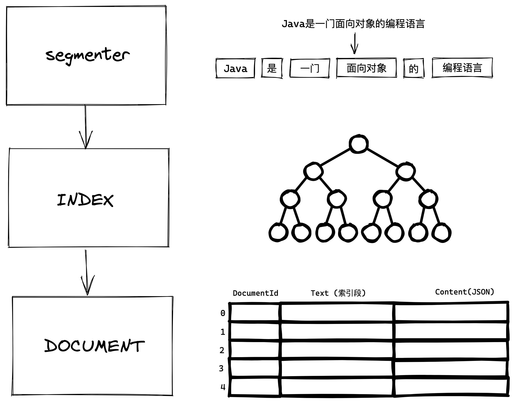

## Farseer

一个极其简陋的轻量级分布式搜索引擎，Farseer 没有 Elastic Search 中 type 等复杂的概念，只关注于查询和索引两件事

### Tech-Stack

Spring Boot, MySQL, MyBatis, Redis, canal, Raft 协议

### Feature

- [x] http 协议，提供 restful api 进行操作
- [x] 智能分词，对输入的句子进行分词查询
- [x] 为数据建立倒排索引
- [x] 查询某个数据的倒排索引
- [x] 对指定关键词过滤 e.g. java -csdn
- [x] 实现关联度算法, tfidf 算法，优先查询出关联度高的数据
- [x] 关键词高亮
- [x] 关键词联想
- [x] 敏感词过滤
- [x] 停用词
- [ ] 文本搜图
- [ ] 以图搜图
- [ ] 集群

### TODO

- [x] Trie
- [x] AC 自动机
- [x] canal 监听数据库
- [ ] 布隆过滤器，redis 做缓存加速搜索
- [ ] raft 协议
